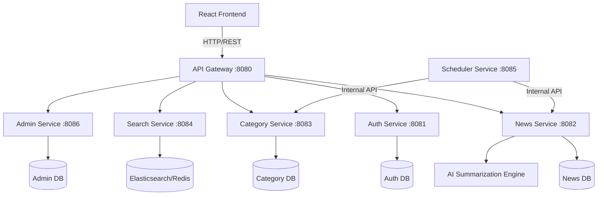

# AI News Platform

A production-grade, AI-powered news aggregator and search platform built with Spring Boot microservices and React. The platform automatically fetches, categorizes, summarizes, and serves the latest news articles from various global sources.

## Project Overview

The AI News Platform is a scalable microservices architecture designed to handle high-throughput news fetching, AI-based content summarization, full-text search, and a modern React frontend. It uses a secure API Gateway, robust JWT authentication, and MySQL/Redis for storage and caching.

## Architecture Diagram



## Technology Stack

### Backend
- **Java 17+** with **Spring Boot 3**
- **Spring Cloud Gateway** for API routing and CORS
- **Spring Security** with stateless JWT authentication
- **Spring Data JPA** & **Hibernate**
- **Flyway** for database migrations

### Frontend
- **React 18** with **TypeScript**
- **Vite** for fast bundling
- **Redux Toolkit** for state management
- **Tailwind CSS** & **shadcn/ui** for styling
- **React Router** for navigation
- **Axios** with interceptors for token refresh

### Infrastructure & Data
- **Docker & Docker Compose** for containerization
- **MySQL** as the primary relational database
- **Redis** for caching and session management
- **Nginx** for frontend production serving
- **Kubernetes** manifests for production deployment

## Features

- **User Authentication**: Secure JWT-based login, registration, and automatic token refresh.
- **News Aggregation**: Automated scheduled fetching of articles from global providers.
- **Category Browsing**: Dynamic categorization (Technology, Sports, Business, etc.).
- **Full-Text Search**: Fast keyword-based search across all articles.
- **Trending News**: Real-time engagement-based trending articles.
- **Saved Articles**: Bookmark favorite articles for later reading.
- **Admin Dashboard**: Internal portal for system management and metrics.

## AI Features & Architecture

The platform leverages Artificial Intelligence to enhance the news consumption experience. The AI processing pipeline is built for **production reliability** and **quota efficiency**:

1. **Combined Analysis Prompting**: To minimize API calls and avoid quota exhaustion, the system uses a single, structured Gemini prompt per article to extract a summary, sentiment label, and relevant keywords simultaneously (a 66% reduction in API calls compared to individual requests).
2. **AI Summarization**: Long-form articles are automatically summarized into concise, easily readable sentences using the Gemini model.
3. **Sentiment Analysis**: Articles are tagged with sentiment badges (Positive, Neutral, Negative) and numerical scores to help readers quickly gauge the tone.
4. **Smart Categorization**: Uncategorized articles are automatically assigned to the most relevant categories using AI classification algorithms.
5. **Centralized Rate Limiting & Circuit Breaker**: All AI threads share a central `GeminiRateLimiter`. It enforces a minimum interval between requests and provides a global cooldown (circuit breaker) if the provider returns an HTTP 429 (Too Many Requests).
6. **Heuristic Fallback Engine**: If the Gemini API is rate-limited, times out, or fails, the orchestrator immediately falls back to a fast, local NLP heuristic provider. Articles are never permanently blocked by an LLM outage.

## Requirements

- **Java 17+** (for manual backend builds)
- **Node.js 18+** (for manual frontend builds)
- **Maven 3.9+**
- **Docker & Docker Compose**

## Installation

1. Clone the repository.
2. Copy `.env.example` to `.env` and configure your local secrets:
   ```bash
   cp .env.example .env
   ```

## Docker Setup

The easiest way to run the entire stack locally is using Docker Compose.

```bash
# Build and start all services
docker compose up --build -d

# View logs for a specific service
docker compose logs -f gateway-service
```

Services will be available at:
- Frontend: `http://localhost:3000`
- API Gateway: `http://localhost:8080`

## Environment Variables

All configuration is managed centrally via `.env`. Key variables include:

### Core Configuration
- `MYSQL_ROOT_PASSWORD`, `MYSQL_USER`, `MYSQL_PASSWORD`: Database credentials.
- `JWT_SECRET`: Secret key for signing JWTs (must be at least 32 characters).
- `INTERNAL_API_KEY`: Secret used for internal service-to-service communication.
- `SPRING_PROFILES_ACTIVE`: Set to `dev` for local development or `prod` for production.

### AI & Gemini Configuration
- `GOOGLE_API_KEY`: Your Gemini API key for the LLM integration.
- `AI_PROCESSING_WORKER_COUNT`: Number of concurrent AI worker threads (default: `2`). Keep this small to protect your free-tier quota.
- `GEMINI_RATE_LIMIT_ENABLED`: Enable or disable the centralized rate limiter (default: `true`).
- `GEMINI_MIN_INTERVAL_MS`: Minimum time between API calls across all threads (default: `6000`ms).
- `GEMINI_COOLDOWN_SECONDS`: Default circuit breaker cooldown when an HTTP 429 is received (default: `60`s).

## Running Backend (Manual)

To run the backend services manually for development:

```bash
# Build all services
mvn clean package -DskipTests

# Run a specific service (e.g., auth-service)
cd auth-service
mvn spring-boot:run
```

Ensure MySQL and Redis are running locally before starting the services manually.

## Running Frontend (Manual)

To run the frontend development server:

```bash
cd frontend
npm install
npm run dev
```
The frontend will be available at `http://localhost:5173`. The API requests will automatically proxy to the Gateway at `http://localhost:8080`.

## API Documentation

Each microservice exposes an OpenAPI (Swagger) specification.
When running locally, you can access the documentation at:
- Auth Service: `http://localhost:8081/swagger-ui.html`
- News Service: `http://localhost:8082/swagger-ui.html`
- Category Service: `http://localhost:8083/swagger-ui.html`

## Database Setup

The databases are automatically created by the `mysql-init.sql` script when starting the database container. Schema migrations are handled automatically by **Flyway** when each Spring Boot service starts up.

## Testing Commands

Run backend unit and integration tests:
```bash
mvn test
```

Run frontend tests:
```bash
cd frontend
npm test
```

## Production Deployment Overview

The application is designed for cloud-native deployment using Kubernetes:
1. **Kubernetes Manifests**: Located in the `/k8s` directory.
2. **Secrets Management**: Uses Bitnami SealedSecrets for secure GitOps credentials.
3. **Ingress**: Configured with Nginx Ingress Controller and TLS termination.
4. **Managed Services**: In production, it's recommended to use managed databases (e.g., AWS RDS, ElastiCache) rather than in-cluster stateful sets.

Deploy to Kubernetes:
```bash
kubectl apply -f k8s/
```
